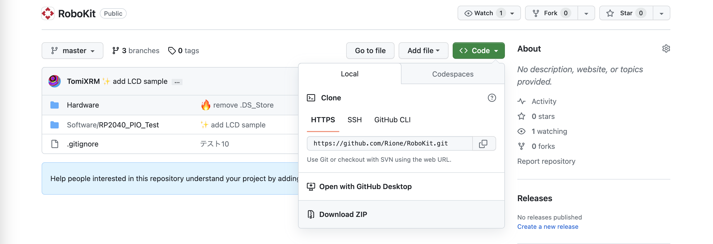

# RoboKit 環境構築

<aside>
👉 目標：自分のPCにRoboKit用のプログラムを持ってきて、VSCodeに拡張機能のPlatformIOをinstallする。

</aside>

# 自分のPCにRoboKitのプログラムを持ってくる

↓これを開く

[GitHub - Rione/RoboKit](https://github.com/Rione/RoboKit/tree/master)

## 2つの方法がある

- ファイルをダウンロードする
- ファイル(リポジトリ)をクローンする

## 方法1



`<>Code`から、`Download ZIP`でZIPファイルをダウンロード。→ 展開する。

RoboKit-masterというフォルダがDownloadsフォルダに保存されている

## 方法2


今回はDownloadsフォルダにRoboKitのフォルダを複製する
↓一行ずつターミナルで実行

```bash
cd
cd Downloads
git clone https://github.com/Rione/RoboKit.git
```

※ ちなみに…  `git clone (URL)` で既存のリポジトリを自分のPC内に複製できる

RoboKitというフォルダがDownloadsフォルダに保存されている

# VSCodeのインストール

[](https://code.visualstudio.com/)

# VSCodeにPlatform IOをinstallする


サイドバーの拡張機能（ブロックのようなアイコン）をクリック

上の検索バーにPlatform IOと入力


これをinstall(インストールボタンをクリックすることで入ります)


サイドバーからPlatform IOを選択して、Quick Access > PIO Home > Projects & Configure を選択すると、上の画面が出てくる。

画面右側のOpenを押すと、RoboKitのテスト用フォルダが開かれる

---


「出力」でいろいろ流れて、最終的に上の画面になったら成功！


企画で使用するファイルは上画面で表示されている、main.cppだけです。

余力のある人は、実際にビルドができるか確認してもらえると嬉しいです。
下の青いラインに並んでいる、✅を押すとビルド、→を押すと書き込みができます。

以上でPCの事前準備はおしまいですが、分からないことがあれば遠慮せずに聞いてください！


---

# Windowsの諸注意

WindowsにGitが入っている必要があります．Gitのインストールをしてください．(自分で調べてください)

### Gitが入っているかの確認

ターミナルで次のコマンドを打ってみてください．

```
git help
```

と打って反応があればGitが入っている証拠です．

- ターミナルで期待される反応はこんな感じです．
    
    ```
    git help
    usage: git [--version] [--help] [-C <path>] [-c <name>=<value>]
               [--exec-path[=<path>]] [--html-path] [--man-path] [--info-path]
               [-p | --paginate | -P | --no-pager] [--no-replace-objects] [--bare]
               [--git-dir=<path>] [--work-tree=<path>] [--namespace=<name>]
               [--super-prefix=<path>] [--config-env=<name>=<envvar>]
               <command> [<args>]
    
    These are common Git commands used in various situations:
    
    start a working area (see also: git help tutorial)
       clone     Clone a repository into a new directory
       init      Create an empty Git repository or reinitialize an existing one
    
    work on the current change (see also: git he
    ```
    

### RoboKitのファイルの初期化時にエラーが出る(longpathエラー)

- WindowsのgitはMacと違い，longpath = falseになっているので，trueにしましょう
- WindowsのGitの入っているPCで以下のコマンドを実行してください．

```
git config --system core.longpaths true
```
